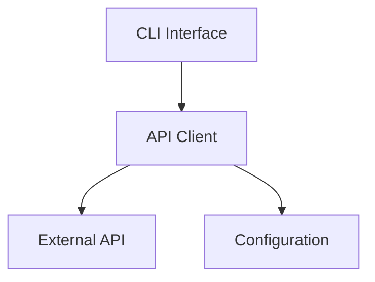

# System Patterns

## Architecture

## Key Components
1. API Client - Handles authentication and requests
2. CLI Interface - Processes commands and displays output
3. Configuration - Manages settings and credentials