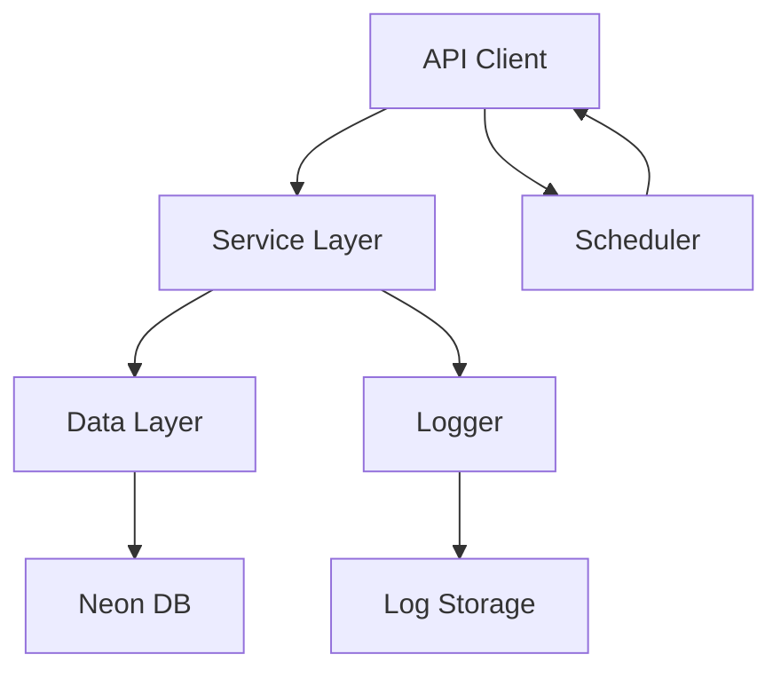
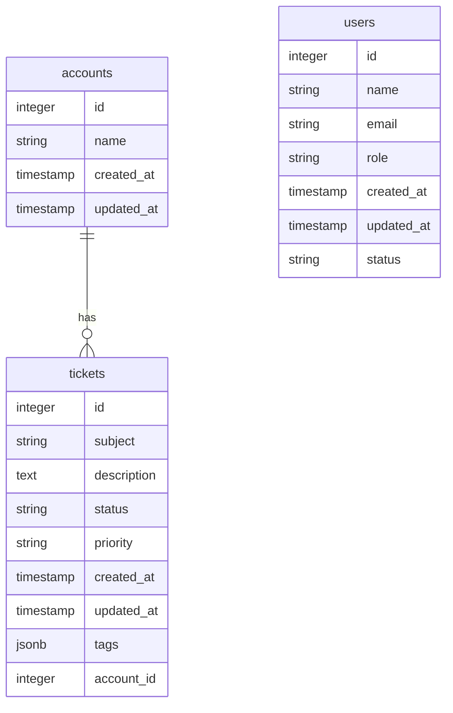
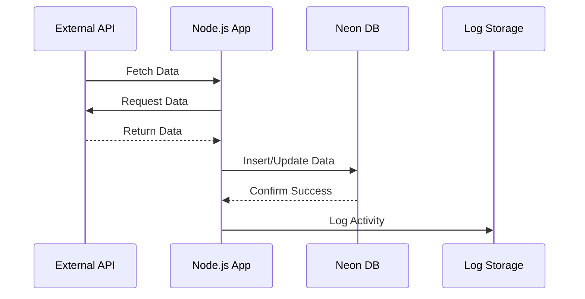

# Node.js Backend Application Plan

## 1. API Endpoint Analysis and Data Extraction Strategy

1. **Authentication**
   - [ ] Use API tokens for authentication (`?token=<api_token>`).
   - [ ] Store the API token securely using environment variables.

2. **Endpoints to Extract**
   - [ ] Accounts: `/api/v1/accounts.json`
   - [ ] Tickets: `/api/v1/tickets.json` (with pagination and filtering)
   - [ ] Users: `/api/v1/users.json`

3. **Data Extraction**
   - [ ] Use pagination to handle large datasets (`?page=<page_number>`).
   - [ ] Implement retry logic for failed requests with exponential backoff.
   - [ ] Use field selection (`?select=<fields>`) to optimize data retrieval.
   - [ ] Schedule periodic data extraction using a cron job or task scheduler.

---

## 2. Node.js Application Architecture Design

4. **Layered Architecture**
   - [ ] **API Layer**: Handle API requests, authentication, and response parsing.
   - [ ] **Service Layer**: Implement business logic for data extraction, transformation, and validation.
   - [ ] **Data Layer**: Manage interactions with the Neon DB database.

5. **Key Components**
   - [ ] **API Client**: A reusable module for making authenticated API requests.
   - [ ] **Data Transformer**: A module to transform API responses into database-ready formats.
   - [ ] **Scheduler**: A module to manage periodic data extraction tasks.

6. **Dependencies**
   - [ ] `axios` for HTTP requests.
   - [ ] `pg` for Neon DB interactions.
   - [ ] `cron` or `node-schedule` for scheduling tasks.
   - [ ] `winston` for logging.

7. **Application Architecture Diagram**

---

## 3. Neon DB Schema Design

8. **Tables**
   - [ ] **accounts**:
     - `id` (Primary Key)
     - `name`
     - `created_at`
     - `updated_at`
   - [ ] **tickets**:
     - `id` (Primary Key)
     - `subject`
     - `description`
     - `status`
     - `priority`
     - `created_at`
     - `updated_at`
     - `tags` (JSONB)
     - `account_id` (Foreign Key to `accounts`)
   - [ ] **users**:
     - `id` (Primary Key)
     - `name`
     - `email`
     - `role`
     - `created_at`
     - `updated_at`
     - `status`

9. **Relationships**
   - [ ] One-to-many: `accounts` → `tickets`
   - [ ] Many-to-many: `tickets` ↔ `users` (via a join table if needed).

10. **Database Schema Diagram**

---

## 4. Data Persistence Implementation

11. **Database Connection**
    - [ ] Use environment variables for Neon DB credentials.
    - [ ] Implement connection pooling for efficient database interactions.

12. **Data Insertion**
    - [ ] Use bulk inserts for efficiency.
    - [ ] Handle conflicts (e.g., duplicate IDs) using `ON CONFLICT` clauses.

13. **Data Updates**
    - [ ] Use timestamps (`updated_at`) to identify and update changed records.
    - [ ] Implement soft deletes where applicable.

---

## 5. Error Handling and Logging

14. **Error Handling**
    - [ ] Retry failed API requests with exponential backoff.
    - [ ] Log API errors and database errors separately.
    - [ ] Notify administrators of critical failures (e.g., via email or Slack).

15. **Logging**
    - [ ] Use structured logging with `winston`.
    - [ ] Log levels: `info`, `warn`, `error`.
    - [ ] Store logs in a centralized location (e.g., Neon DB or external logging service).

16. **Data Flow Diagram**

---

## 6. Next Steps

17. [ ] Review and approve this plan.
18. [ ] Switch to **Code Mode** to begin implementation.