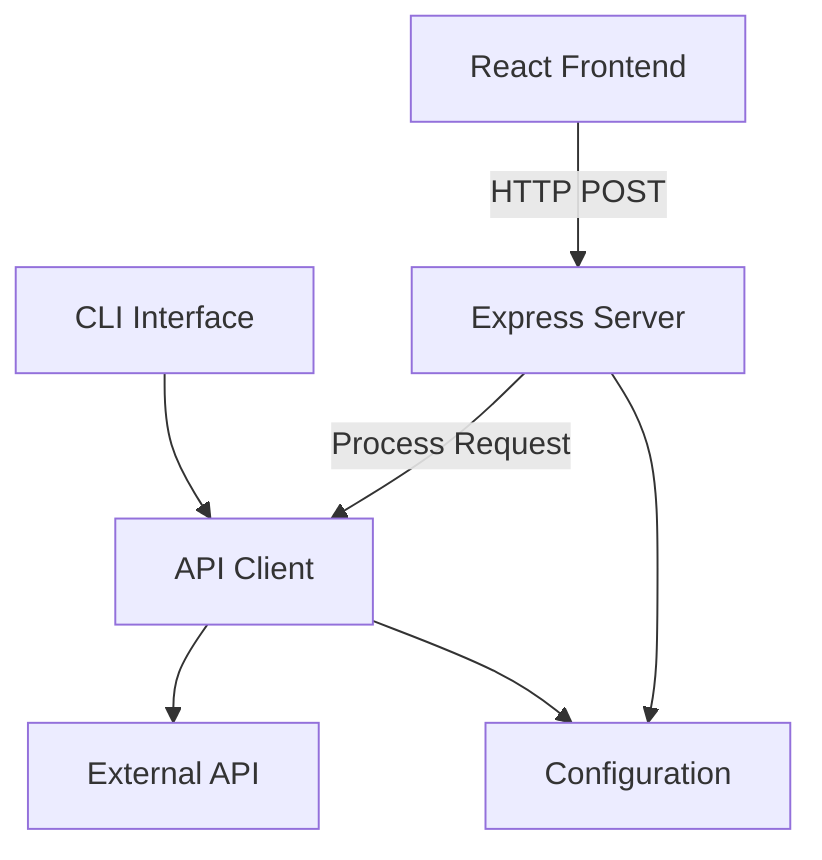

# HTTP POST Transition Plan

## Architecture Diagram

## Implementation Checklist

1. [ ] Add Express.js and CORS dependencies
2. [ ] Create server.js with:
   - POST endpoint handlers
   - Request validation
   - Error handling
   - CORS configuration
3. [ ] Modify apiClient.js to:
   - Support both CLI and HTTP modes
   - Handle JSON request/response format
   - Maintain existing authentication
4. [ ] Update config.js to:
   - Add server port configuration
   - Add CORS allowed origins
5. [ ] Create new endpoints for:
   - Authentication
   - Data submission
   - Status checking
6. [ ] Update documentation in CC_API_docs

## Detailed Steps

### 1. Add Dependencies
- Install Express.js and CORS packages
- Update package.json

### 2. Create Server.js
- Set up Express server
- Add middleware for:
  - JSON parsing
  - CORS
  - Authentication
- Create POST route handlers

### 3. Modify API Client
- Add HTTP mode support
- Maintain CLI compatibility
- Update request handling

### 4. Configuration Updates
- Add server port setting
- Configure allowed origins
- Update environment variables

### 5. Endpoint Implementation
- /api/auth for authentication
- /api/data for submissions
- /api/status for system checks

### 6. Documentation
- Update API docs with new endpoints
- Add HTTP request examples
- Document configuration changes